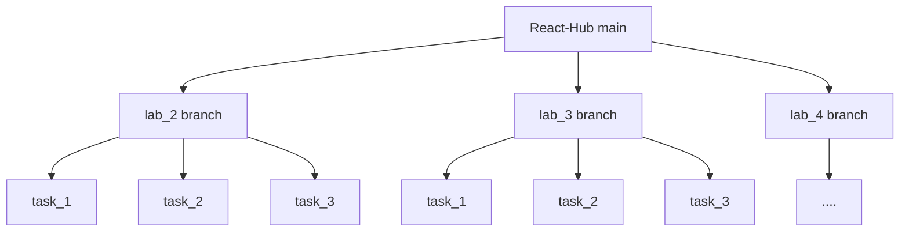

# ⚛️ JavaScript

**JavaScript** — это общий репозиторий-хаб для всех моих проектов, лабораторных работ и экспериментов.  
Каждый проект хранится **в отдельной ветке**, чтобы сохранить чистую структуру и историю.

---

## 🧭 Навигация по проектам

> 🔁 **Проекты находятся в ветках**  
> Используйте ссылки ниже, чтобы сразу перейти к нужной ветке.

### 📚 Лабораторные работы
-   **Lab 1** → [`lab_1` ветка](../../tree/Lab-1)
-   **Lab 2** → [`lab_2` ветка](../../tree/Lab-2)
-   **Lab 3** → [`lab_3` ветка](../../tree/Lab-3)

(список будет дополняться)

---

## 🌿 Структура репозитория (логика)

